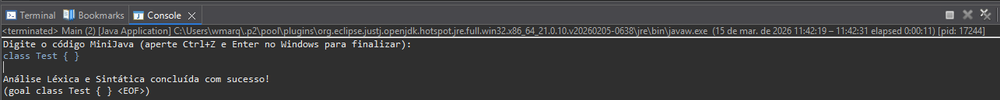
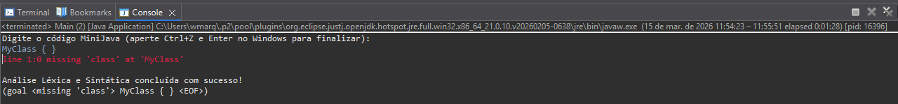

# Compilador MiniJava para arquitetura MIPS — Analisador Léxico e Sintático [Etapa 01]

**Equipe 19**
- Werbster Marques Teixeira [537205]
- Guilherme Gomes Botelho

---

## Descrição

Esta etapa corresponde à **primeira fase** do desenvolvimento de um compilador para a linguagem MiniJava, cujo alvo é a arquitetura MIPS. O objetivo é implementar o **front-end** do compilador, composto pelo analisador léxico (*lexer*) e pelo analisador sintático (*parser*), utilizando a ferramenta geradora de parsers **ANTLR 4** (*Another Tool for Language Recognition*).

A gramática foi especificada no arquivo `MiniJava.g4`, no qual estão definidas tanto as regras léxicas quanto as regras sintáticas da linguagem. A partir desse arquivo, o ANTLR gera automaticamente as classes `MiniJavaLexer` e `MiniJavaParser` em Java, além das interfaces de *listener* (`MiniJavaListener`, `MiniJavaBaseListener`). A classe `Main.java` orquestra o pipeline de análise, alimentando o fluxo de entrada pelo lexer, encadeando os tokens ao parser e invocando a regra raiz da gramática (`goal`).

A gramática implementada nesta etapa reconhece a estrutura básica de uma declaração de classe MiniJava vazia:

```
class <Identifier> { }
```

---

## Pré-Requisitos

- **Java JDK** 8 ou superior instalado e configurado no `PATH`
- **ANTLR 4.13.2** — arquivo JAR completo (`antlr-4.13.2-complete.jar`) disponível localmente
  - Download: [https://www.antlr.org/download/antlr-4.13.2-complete.jar](https://www.antlr.org/download/antlr-4.13.2-complete.jar)
  - Recomenda-se salvar em `C:\antlr\antlr-4.13.2-complete.jar`
- Variável de ambiente `CLASSPATH` configurada para incluir o JAR do ANTLR e o diretório atual:
  ```
  set CLASSPATH=.;C:\antlr\antlr-4.13.2-complete.jar
  ```

---

## Setup — Geração dos Arquivos do Parser

Após clonar ou descompactar o projeto, navegue até o diretório `ETAPA 1 - parsing` e execute o ANTLR sobre o arquivo de gramática para gerar os artefatos Java:

```bash
java -jar C:\antlr\antlr-4.13.2-complete.jar MiniJava.g4
```

Isso gera os seguintes arquivos:
| Arquivo gerado | Descrição |
|---|---|
| `MiniJavaLexer.java` | Analisador léxico gerado automaticamente |
| `MiniJavaParser.java` | Analisador sintático gerado automaticamente |
| `MiniJavaListener.java` | Interface de listener para travessia da árvore |
| `MiniJavaBaseListener.java` | Implementação padrão (vazia) do listener |
| `MiniJava.tokens` / `MiniJavaLexer.tokens` | Mapeamento de tokens |
| `MiniJava.interp` / `MiniJavaLexer.interp` | Dados de interpretação em tempo de execução |

Em seguida, compile todos os arquivos Java:

```bash
javac -cp .;C:\antlr\antlr-4.13.2-complete.jar *.java
```

---

## Status da Etapa

A etapa foi **parcialmente concluída**.

Foi implementada a estrutura de *pipeline* do compilador (entrada → lexer → stream de tokens → parser → árvore sintática) e a gramática contém a regra sintática raiz `goal`, que reconhece a declaração de uma classe MiniJava vazia (`class <Identifier> { }`), além das regras léxicas para `Identifier` e descarte de espaços em branco (`WS`).

**O que não foi concluído:** A gramática ainda não contempla as demais produções da linguagem MiniJava completa, como declarações de métodos, variáveis, expressões, comandos (`if`, `while`, `return`, etc.) e a classe principal (`MainClass`). A expansão das regras da gramática para cobrir toda a especificação da linguagem é o escopo restante desta etapa.

---

## Execução do Programa

### Compilação e execução

Após o setup, execute o programa com:

```bash
java -cp .;C:\antlr\antlr-4.13.2-complete.jar Main
```

O programa aguarda entrada via `stdin`. Digite o código MiniJava e, no Windows, pressione `Ctrl+Z` seguido de `Enter` para sinalizar o fim da entrada (EOF).

### Testes realizados

**Entrada válida (caso de sucesso):**
```
class MinhaClasse { }
```
**Saída esperada:**
```
Digite o código MiniJava (aperte Ctrl+Z e Enter no Windows para finalizar):
class Test { }
^Z

Análise Léxica e Sintática concluída com sucesso!
(goal 'class' Test '{' '}' <EOF>)
```




**Entrada inválida (caso de erro sintático):**
```
MyClass { }
```
**Saída esperada:** O ANTLR reporta um erro de reconhecimento sintático, pois a entrada não satisfaz a regra `goal` (ausência da palavra-chave `class`).



### Erros de execução encontrados

Nenhum erro de execução (*runtime exception*) foi identificado nas entradas testadas. Entradas que violam a gramática são tratadas pelo mecanismo de recuperação de erros padrão do ANTLR (`DefaultErrorStrategy`), que reporta o erro no `stderr` sem interromper abruptamente o processo.

---

## Dificuldades Encontradas

- **Configuração do ambiente:** A configuração correta do `CLASSPATH` para incluir o JAR do ANTLR tanto na fase de geração do parser quanto na compilação e execução dos arquivos Java gerados exigiu atenção especial, especialmente no Windows com PowerShell, onde o separador de `CLASSPATH` é `;` e não `:`.
- **Compreensão do pipeline do ANTLR:** Entender o fluxo `CharStream → Lexer → TokenStream → Parser → ParseTree` e como cada componente gerado se interliga foi o principal desafio conceitual desta etapa.
- **Distinção entre regras léxicas e sintáticas:** No ANTLR 4, regras que iniciam com letra maiúscula são interpretadas como regras léxicas (*tokens*) e regras com letra minúscula como regras sintáticas (*parser rules*). Essa convenção, caso não observada, gera erros silenciosos na gramática.

---

## Participação

| Membro | Participação |
|---|---|
| Werbster Marques Teixeira [537205] | Configuração do ambiente ANTLR, definição da gramática `MiniJava.g4`, implementação de `Main.java`, testes de execução e elaboração do README |
| Guilherme Gomes Botelho | [descrever participação] |
