# Compilador MiniJava para arquitetura MIPS — Analisador Léxico e Sintático [Etapa 01]

**Equipe 19**
- Werbster Marques Teixeira [537205]
- Guilherme Gomes Botelho [539008]

---

## Descrição

Esta etapa corresponde à **primeira fase** do desenvolvimento de um compilador para a linguagem MiniJava, cujo alvo é a arquitetura MIPS. O objetivo é implementar o **front-end** do compilador, composto pelo analisador léxico (*lexer*) e pelo analisador sintático (*parser*), utilizando a ferramenta geradora de parsers **ANTLR 4** (*Another Tool for Language Recognition*).

A gramática foi especificada no arquivo `MiniJava.g4`, no qual estão definidas tanto as regras léxicas quanto as regras sintáticas da linguagem MiniJava completa conforme o manual de referência. A partir desse arquivo, o ANTLR gera automaticamente as classes `MiniJavaLexer` e `MiniJavaParser` em Java, além das interfaces de *listener* (`MiniJavaListener`, `MiniJavaBaseListener`). A classe `Main.java` orquestra o pipeline de análise, alimentando o fluxo de entrada pelo lexer, encadeando os tokens ao parser e invocando a regra raiz da gramática (`goal`).

---

## Status da Etapa

A etapa foi **completamente concluída**.

A gramática `MiniJava.g4` implementa todas as produções da linguagem MiniJava conforme o manual de referência (Apêndice A), cobrindo:

- Todas as regras sintáticas: `goal`, `mainClass`, `classDecl` (com e sem `extends`), `varDecl`, `methodDecl`, `formalList`, `formalRest`, `type`, `statement`, `exp`, `expList`, `expRest`
- Todas as regras léxicas: `INTEGER_LITERAL`, `Identifier`, `WS` (ignorado), `LINE_COMMENT` e `BLOCK_COMMENT` (ignorados)
- Todos os operadores binários especificados: `+`, `-`, `*`, `<`, `&&`
- Precedência de operadores resolvida diretamente na regra `exp`

---

## Erros de Execução Encontrados

Nenhum erro de execução (*runtime exception*) foi identificado nas entradas testadas. Todas as entradas válidas foram aceitas pela gramática e produziram a árvore sintática corretamente. As entradas inválidas foram tratadas pelo mecanismo de recuperação de erros padrão do ANTLR (`DefaultErrorStrategy`), que reporta o erro sintático ou léxico no `stderr` **sem interromper abruptamente o processo** — ou seja, não há *crash*, apenas mensagens de erro descritivas.

| Entrada | Tipo de erro reportado | Houve exception? |
|---|---|---|
| `invalido_01_sem_class.mj` | Erro sintático: `missing 'class'` | Não |
| `invalido_02_id_com_numero.mj` | Erro léxico: `token recognition error` | Não |
| `invalido_03_if_sem_else.mj` | Erro sintático: `missing 'else'` | Não |
| `invalido_04_operador_invalido.mj` | Erro léxico: `token recognition error at '%'` | Não |
| `invalido_05_sem_return.mj` | Erro sintático: `missing 'return'` | Não |

---

## Estrutura do Projeto

```
ETAPA01_parsing/
├── MiniJava.g4                        # Gramática ANTLR 4 (léxica + sintática)
├── Main.java                          # Ponto de entrada do compilador
├── build.ps1                          # Script de build (gerar + compilar)
├── MiniJavaLexer.java                 # Gerado pelo ANTLR
├── MiniJavaParser.java                # Gerado pelo ANTLR
├── MiniJavaListener.java              # Gerado pelo ANTLR
├── MiniJavaBaseListener.java          # Gerado pelo ANTLR
├── imgs/
│   ├── testes_entradas_validas/       # Screenshots dos testes válidos
│   └── testes_entradas_invalidas/     # Screenshots dos testes inválidos
└── testes/
    ├── entradas_validas/              # Programas MiniJava corretos
    │   ├── valido_01_factorial.mj
    │   ├── valido_02_tipos_e_vars.mj
    │   ├── valido_03_expressoes.mj
    │   ├── valido_04_statements.mj
    │   ├── valido_05_heranca.mj
    │   └── valido_06_comentarios.mj
    └── entradas_invalidas/            # Programas com erros propositais
        ├── invalido_01_sem_class.mj
        ├── invalido_02_id_com_numero.mj
        ├── invalido_03_if_sem_else.mj
        ├── invalido_04_operador_invalido.mj
        └── invalido_05_sem_return.mj
```

---

## Pré-Requisitos

- **Java JDK** 8 ou superior instalado e configurado no `PATH`
- **ANTLR 4.13.2** — arquivo JAR completo (`antlr-4.13.2-complete.jar`) disponível localmente
  - Download: [https://www.antlr.org/download/antlr-4.13.2-complete.jar](https://www.antlr.org/download/antlr-4.13.2-complete.jar)
  - Recomenda-se salvar em `C:\antlr\antlr-4.13.2-complete.jar`
- Variável de ambiente `CLASSPATH` configurada para incluir o JAR do ANTLR e o diretório atual:
  ```
  set CLASSPATH=.;C:\antlr\antlr-4.13.2-complete.jar
  ```

---

## Setup — Geração dos Arquivos do Parser

Após clonar ou descompactar o projeto, navegue até o diretório `ETAPA01_parsing` e execute o ANTLR sobre o arquivo de gramática para gerar os artefatos Java:

```bash
java -jar "C:\antlr\antlr-4.13.2-complete.jar" MiniJava.g4
```

Isso gera os seguintes arquivos:

| Arquivo gerado | Descrição |
|---|---|
| `MiniJavaLexer.java` | Analisador léxico gerado automaticamente |
| `MiniJavaParser.java` | Analisador sintático gerado automaticamente |
| `MiniJavaListener.java` | Interface de listener para travessia da árvore |
| `MiniJavaBaseListener.java` | Implementação padrão (vazia) do listener |
| `MiniJava.tokens` / `MiniJavaLexer.tokens` | Mapeamento de tokens |
| `MiniJava.interp` / `MiniJavaLexer.interp` | Dados de interpretação em tempo de execução |

Em seguida, compile todos os arquivos Java:

```bash
javac -cp ".;C:\antlr\antlr-4.13.2-complete.jar" *.java
```

> **Dica:** Use o script `build.ps1` para executar os dois passos acima de uma vez:
> ```powershell
> .\build.ps1
> ```

---

## Execução do Programa

```bash
java -cp ".;C:\antlr\antlr-4.13.2-complete.jar" Main
```

O programa aguarda entrada via `stdin`. Digite o código MiniJava e, no Windows, pressione `Ctrl+Z` seguido de `Enter` para sinalizar o fim da entrada (EOF).

Ou redirecione um arquivo de teste diretamente:

```bash
java -cp ".;C:\antlr\antlr-4.13.2-complete.jar" Main < testes\entradas_validas\valido_01_factorial.mj
```

---

## Testes Realizados

### Entradas Válidas

Programas que seguem a gramática MiniJava e devem ser aceitos sem erros.

---

#### `valido_01_factorial.mj` — Programa Fatorial (exemplo do manual)

Testa: `mainClass`, `classDecl`, `methodDecl`, `varDecl`, `if/else`, `exp` com chamada de método, operadores e `this`.

```java
class Factorial {
  public static void main(String[] a) {
    System.out.println(new Fac().ComputeFac(10));
  }
}

class Fac {
  public int ComputeFac(int num) {
    int num_aux;
    if (num < 1)
      num_aux = 1;
    else
      num_aux = num * (this.ComputeFac(num - 1));
    return num_aux;
  }
}

```

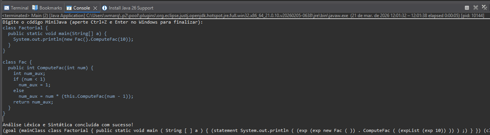

---

#### `valido_02_tipos_e_vars.mj` — Todos os Tipos e varDecl

Testa: declarações com `int`, `boolean`, `int[]` e `Identifier` como tipo.

```java
class TesteTipos {
  public static void main(String[] a) {                 
     System.out.println(0); 
   }
}

class Tipos {
  public int testaTipos(int x) {
    int numero;  
    boolean flag;  
    int[] vetor;  
    Tipos obj;
    numero = 42; 
    flag = true;
    return numero;
  }
}

```

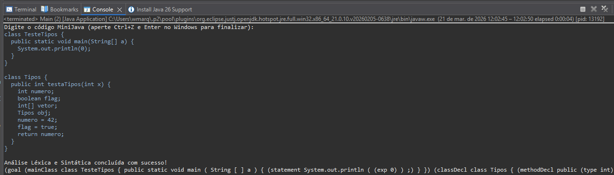

---

#### `valido_03_expressoes.mj` — Todas as Formas de Expressão

Testa: operadores `+`, `-`, `*`, `<`, `&&`, acesso a array `v[i]`, `.length`, `new int[]`, `new Classe()`, `!exp`.

```java
class TesteExp {
  public static void main(String[] a) {                 
     System.out.println(new Calc().run()); 
   }
}

class Calc {
  public int run() {
    int[] v;
    int resultados;
    boolean b;
    
    v = new int[10];
    v[0] = 5;
    v[1] = 3;

    resultado = v[0] + v[1];   // op: +
    resultado = v[0] - v[1];   // op: -
    resultado = v[0] * v[1];   // op: *
    b = v[0] < v[1];           // op: <
    b = true && false;         // op: &&
    b = !b;                    // ! exp
    resultado = v.length;      // exp.length
    return resultado;
  }
}

```

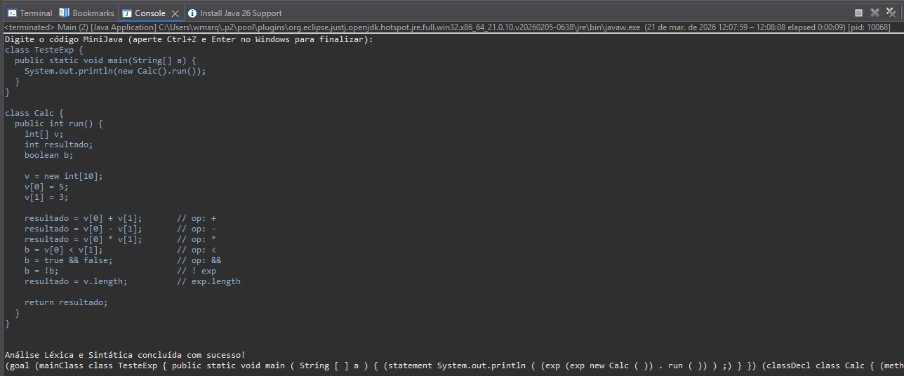

---

#### `valido_04_statements.mj` — Todos os Statements

Testa: `if/else`, `while`, `System.out.println`, atribuição simples (`id = exp`), atribuição de array (`id[exp] = exp`), bloco `{ statement* }`.

```java
class TesteStatements {
  public static void main(String[] a) {                 
     System.out.println(new Stmts().run()); 
   }
}

class Stmts {
  public int run() {
    int x;
    int[] v;
    int i;
    
    x = 0;
    v = new int[5];
    i = 0;
    
    // while
    while (i < 5) {
       v[i] = i;              // atribuição de array
       i = i + i;             // atribuição simples
    }
    
    // if/else
    if (x < 1) {
       x = 10;
    } else {
       x = 20;
    }
    
    // bloco aninhado
    {
       x = x + 1;
       System.out.println(x);
    }
    
    return x;
  }
}

```

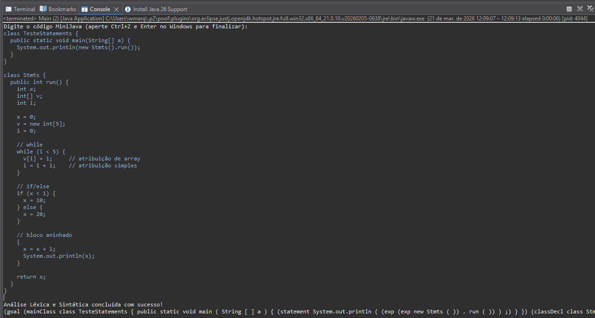

---

#### `valido_05_heranca.mj` — Herança com `extends`

Testa: `classDecl` com `extends`, `formalList` com múltiplos parâmetros (`formalRest`), `expList` com múltiplos argumentos (`expRest`).

```java
class TesteHeranca {
  public static void main(String[] a) {                 
     System.out.println(new Filho().soma(3, 4)); 
   }
}

class Pai {
  public int soma(int a, int b) {               
     return a+ b;               
  }
}

class Filho extends Pai {
  public int  soma(int a, int b) {            
     return a + b + 1;
  }
}

```

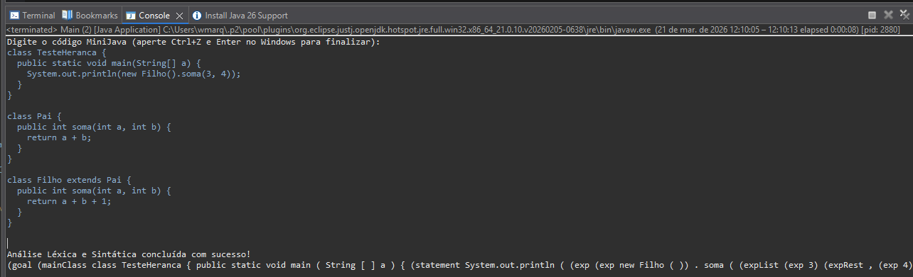

---

#### `valido_06_comentarios.mj` — Comentários Léxicos

Testa: regras léxicas `LINE_COMMENT` (`//`) e `BLOCK_COMMENT` (`/* */`) sendo ignoradas pelo lexer.

```java
class TesteComentarios {
  //  comentario na classe principal
  public static void main(String[] a) {                 
     // comentário de linha
     /* comentário de bloco */
     /* comentario inline */ System.out.println(42); // fim de linha
   }
}

```

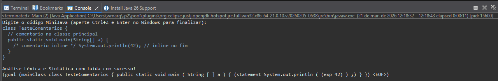

---

### Entradas Inválidas

Programas com erros propositais que devem gerar mensagens de erro do ANTLR.

---

#### `invalido_01_sem_class.mj` — Falta keyword `class`

```java
Factorial {  // falta 'class' antes
  public static void main(String[] a) {                 
     System.out.println(0);
  }
}

```

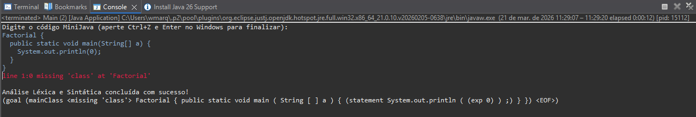

---

#### `invalido_02_id_com_numero.mj` — Identificador começando com dígito

```java
class 1Invalido {  // identificador inválido léxicamente
  public static void main(String[] a) {                 
     System.out.println(0);
  }
}

```

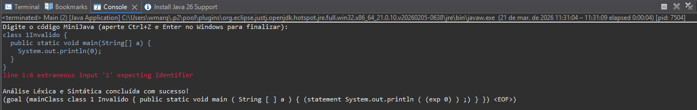

---

#### `invalido_03_if_sem_else.mj` — `if` sem `else`

```java
class SemElse {
  public static void main(String[] a) {                 
     System.out.println(0); 
   }
}

class Teste {
  public int run() {                 
     int x;                 
     x = 0;                 
     if (x < 1)                 
        x = 10;
     // sem 'else' — inválido em MiniJava
     return x;
   }
}

```

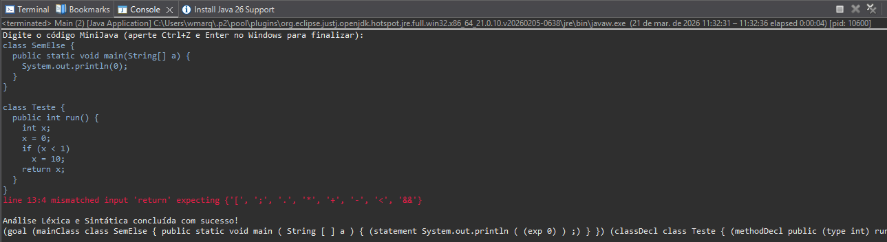

---

#### `invalido_04_operador_invalido.mj` — Operador `%` não suportado

```java
class OpInvalido {
  public static void main(String[] a) {                 
     System.out.println(new Calc().run()); 
   }
}

class Calc {
  public int run() {                 
     int x;                 
     x = 10 % 3;  // % não existe em MiniJava 
     return x;
   }
}

```

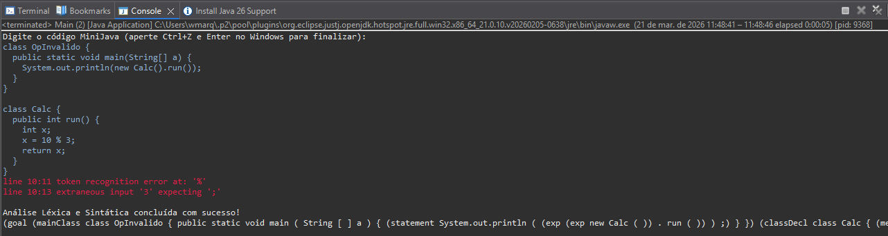

---

#### `invalido_05_sem_return.mj` — Método sem `return`

```java
class SemReturn {
  public static void main(String[] a) {                 
     System.out.println(0); 
   }
}

class Teste {
  public int run() {                 
     int x;
     x = 42;
     // sem 'return' — inválido
  }
}

```

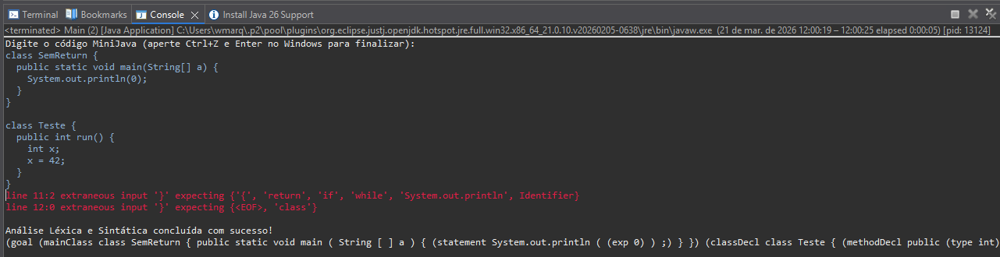

---

## Dificuldades Encontradas

- **Configuração do ambiente:** A configuração correta do `CLASSPATH` para incluir o JAR do ANTLR tanto na fase de geração do parser quanto na compilação e execução dos arquivos Java gerados exigiu atenção especial, especialmente no Windows com PowerShell, onde o separador de `CLASSPATH` é `;` e não `:`.
- **Compreensão do pipeline do ANTLR:** Entender o fluxo `CharStream → Lexer → TokenStream → Parser → ParseTree` e como cada componente gerado se interliga foi o principal desafio conceitual desta etapa.
- **Distinção entre regras léxicas e sintáticas:** No ANTLR 4, regras que iniciam com letra maiúscula são interpretadas como regras léxicas (*tokens*) e regras com letra minúscula como regras sintáticas (*parser rules*). Essa convenção, caso não observada, gera erros silenciosos na gramática.
- **Ambiguidade em expressões:** A regra `exp op exp` com uma regra `op` separada não resolve precedência de operadores automaticamente no ANTLR 4. A solução adotada foi inlinear os operadores diretamente na regra `exp`, com alternativas ordenadas da maior para a menor precedência.

---

## Participação

| Membro | Participação |
|---|---|
| Werbster Marques Teixeira [537205] | Configuração do ambiente ANTLR, ajustes na gramática `MiniJava.g4`, implementação de `Main.java`, casos de teste e elaboração do README |
| Guilherme Gomes Botelho [539008] | Definição da gramática `MiniJava.g4`, revisão dos casos de testes e auxílio na elaboração do README |
