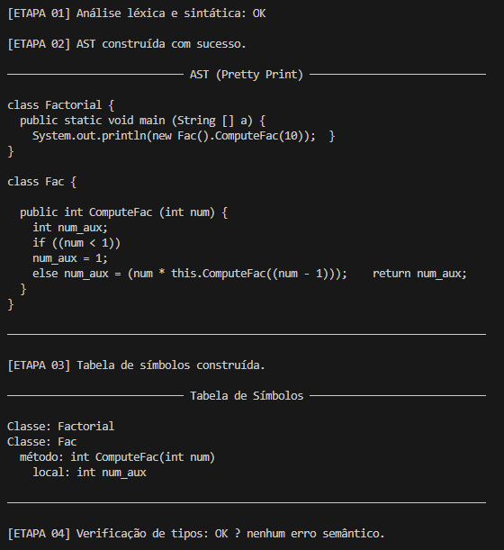
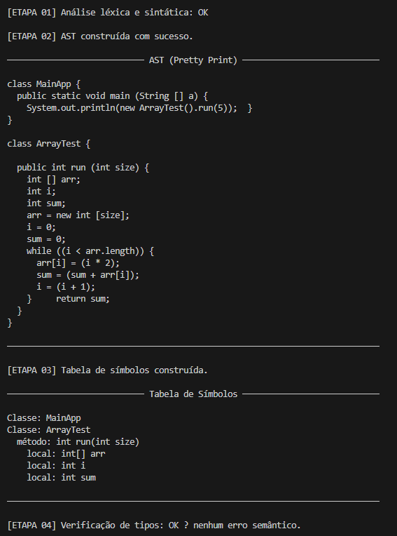
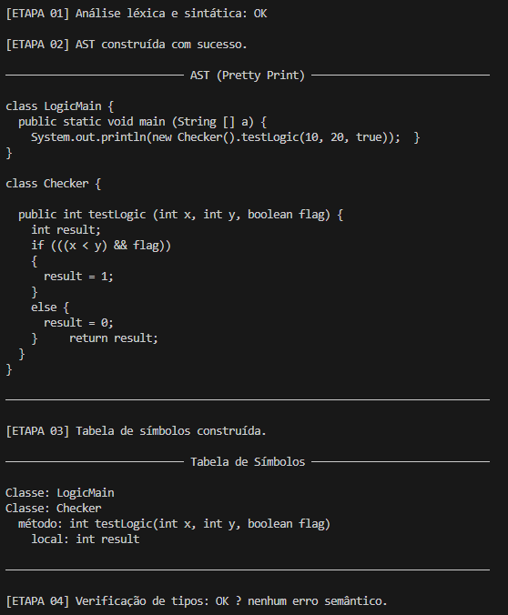
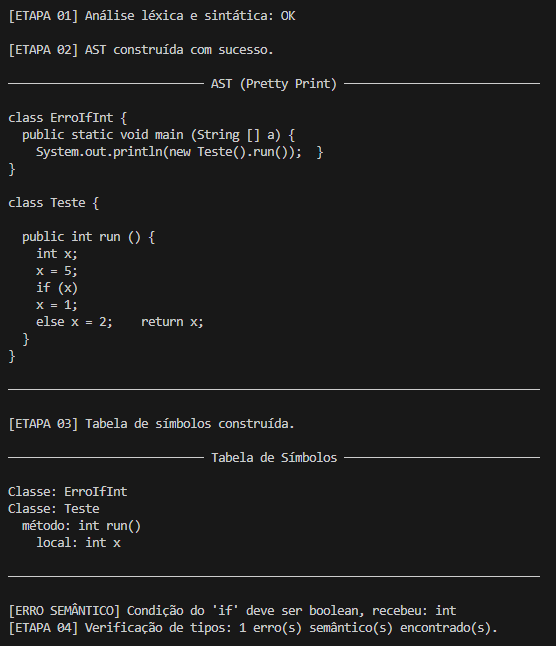
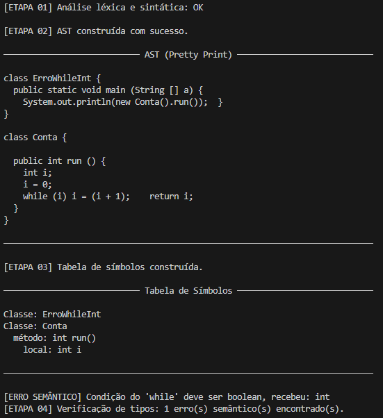
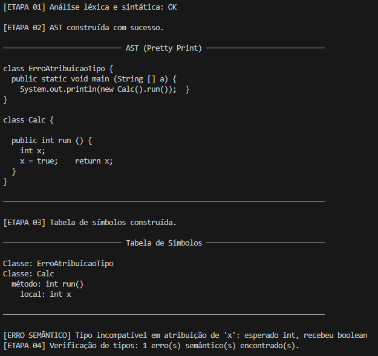
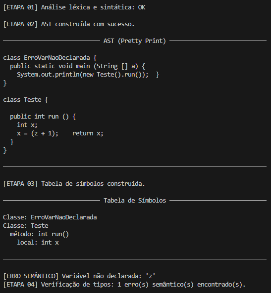
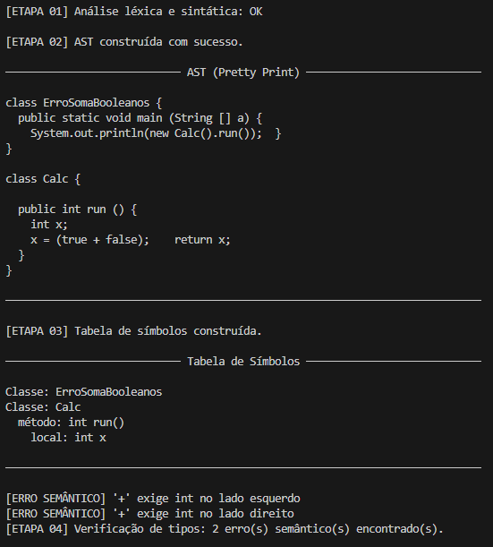
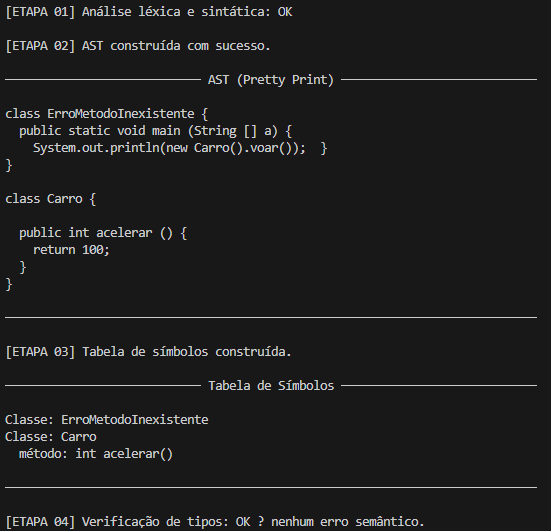

# Compilador MiniJava para arquitetura MIPS — AST e Análise Semântica [Etapa 02]

**Equipe 19**
- Werbster Marques Teixeira [537205]
- Guilherme Gomes Botelho [539008]

---

## Descrição

Esta etapa corresponde à **segunda fase** do desenvolvimento de um compilador para a linguagem MiniJava, cujo alvo é a arquitetura MIPS. O objetivo é estender o front-end previamente implementado (analisador léxico e sintático com ANTLR) para incluir:

- Construção da Árvore Sintática Abstrata (AST)
- Construção da Tabela de Símbolos
- Realização da Verificação Semântica (Type Checking)

A partir da árvore sintática concreta (Parse Tree) gerada pelo ANTLR, foi utilizado o padrão Visitor para construir a árvore sintática abstrata (AST). Em seguida, outro visitante percorre essa estrutura para coletar informações semânticas (declarações de classes, métodos e variáveis), assim, formando a tabela de símbolos. Por fim, é realizada a verificação de tipos e de consistência semântica do programa.

---

## Status da Etapa

A etapa foi **completamente concluída**.

Foram implementadas as seguintes funcionalidades:

- Construção completa da AST a partir da Parse Tree (BuildASTVisitor)
- Estrutura completa da AST (syntaxtree/) com suporte a:
	- classes simples e com herança
	- declarações de variáveis e métodos
	- todos os tipos da linguagem (int, boolean, int[], classes)
	- statements (if, while, print, atribuições, blocos)
	- expressões (aritméticas, lógicas, chamadas de método, arrays, etc.)
	
- Construção da tabela de símbolos (SymbolTableBuilder)

- Estrutura de bindings:
	- ClassBinding
	- MethodBinding
	
- Verificação semântica (TypeCheckVisitor), incluindo:
	- verificação de declaração de variáveis
	- verificação de tipos em expressões
	- verificação de chamadas de método (existência e tipo de retorno)
	- verificação de herança 
	- verificação de tipos em atribuições
	
- Impressão da AST (PrettyPrintVisitor) para depuração

---

## Erros de Execução Encontrados

Nenhum erro de execução (*runtime exception*) foi identificado nas entradas testadas. Todas as entradas válidas foram aceitas pela gramática e produziram a árvore sintática corretamente. As entradas inválidas foram tratadas pelo mecanismo de recuperação de erros padrão do ANTLR (`DefaultErrorStrategy`), que reporta o erro sintático, léxico ou semântico no `stderr` **sem interromper abruptamente o processo** — ou seja, não há *crash*, apenas mensagens de erro descritivas.

| Entrada | Tipo de erro reportado | Houve exception? |
|---|---|---|
| `semantico_invalido_01_if_com_int.mj` | Erro semântico: `condição do 'if' deve ser boolean, recebeu: int` | Não |
| `semantico_invalido_02_while_com_int.mj` | Erro semântico: `condição do 'while' deve ser boolean, recebeu: int` | Não |
| `semantico_invalido_03_atribuicao_tipo_errado.mj` | Erro semântico: `tipo incompatível em atribuição de 'x': esperado int, recebeu boolean` | Não |
| `semantico_invalido_04_variavel_nao_declarada.mj` | Erro semântico: `variável não declarada: 'z'` | Não |
| `semantico_invalido_05_soma_de_booleanos.mj` | Erro semântico: `'+' exige int no lado esquerdo e no lado direito` | Não |
| `semantico_invalido_06_metodo_inexistente.mj` | Erro semântico: `Método 'voar' não encontrado na classe 'Carro'` | Não |

---

## Estrutura do Projeto

```
ETAPA02_AST_Symbol_Table_Type_Checking/
├── MiniJava.g4                        # Gramática ANTLR 4 (léxica + sintática)
├── Main.java                          # Ponto de entrada do compilador
├── build.ps1                          # Script de build (gerar + compilar)
├── run.ps1                            # Script para rodar todos os código de teste
├── MiniJavaLexer.java                 # Gerado pelo ANTLR
├── MiniJavaParser.java                # Gerado pelo ANTLR
├── MiniJavaListener.java              # Gerado pelo ANTLR
├── MiniJavaBaseListener.java          # Gerado pelo ANTLR
├── imgs/
│   ├── testes_entradas_validas/       # Screenshots dos testes válidos
│   └── testes_entradas_invalidas/     # Screenshots dos testes inválidos
├── symboltable/                       # # Tabela de símbolos
│   ├── ClassBinding.java
│   ├── MethodBinding.java
│   ├── SymbolTable.java
│   └── SymbolTableBuilder.java
├── syntaxtree/                        # Estrutura da AST
│   ├── And.java
│   ├── ArrayAssign.java
│   ├── ArrayLength.java
│   ├── ArrayLookup.java
│   ├── ArrayLookup.java
│   ├── Block.java
│   ├── BooleanType.java
│   ├── Call.java
│   ├── ClassDecl.java
│   ├── ClassDeclExtends.java
│   ├── ClassDeclList.java
│   ├── ClassDeclSimple.java
│   ├── Exp.java
│   ├── ExpList.java
│   ├── False.java
│   ├── Formal.java
│   ├── FormalList.java
│   ├── Identifier.java
│   ├── IdentifierExp.java
│   ├── IdentifierType.java
│   ├── If.java
│   ├── IntArrayType.java
│   ├── IntegerLiteral.java
│   ├── IntegerType.java
│   ├── LessThan.java
│   ├── MainClass.java
│   ├── MethodDecl.java
│   ├── MethodDeclList.java
│   ├── Minus.java
│   ├── NewArray.java
│   ├── NewObject.java
│   ├── Not.java
│   ├── Plus.java
│   ├── Print.java
│   ├── Program.java
│   ├── Statement.java
│   ├── StatementList.java
│   ├── This.java
│   ├── Times.java
│   ├── True.java
│   ├── Type.java
│   ├── VarDecl.java
│   ├── VarDeclList.java
│   └── While.java
├── testes/                            # Programas MiniJava corretos e incorretos para teste
│   ├── semantico_invalido_01_if_com_int.mj
│   ├── semantico_invalido_02_while_com_int.mj
│   ├── semantico_invalido_03_atribuicao_tipo_errado.mj
│   ├── semantico_invalido_04_variavel_nao_declarada.mj
│   ├── semantico_invalido_05_soma_de_booleanos.mj
│   ├── semantico_invalido_06_metodo_inexistente.mj
│   ├── semantico_valido_01_factorial.mj
│   ├── semantico_valido_02_arrays_while.mj
│   └── semantico_valido_03_objetos_logica.mj
└── visitor/                           # Implementação do padrão Visitor                                  
    ├── BuildASTVisitor.java
    ├── DepthFirstVisitor.java
    ├── PrettyPrintVisitor.java
    ├── TypeCheckVisitor.java
    ├── TypeDepthFirstVisitor.java
    ├── TypeVisitor.java
    └── Visitor.java

```

---

## Pré-Requisitos

- **Java JDK** 8 ou superior instalado e configurado no `PATH`
- **ANTLR 4.13.2** — arquivo JAR completo (`antlr-4.13.2-complete.jar`) disponível localmente
  - Download: [https://www.antlr.org/download/antlr-4.13.2-complete.jar](https://www.antlr.org/download/antlr-4.13.2-complete.jar)
  - Recomenda-se salvar em `C:\antlr\antlr-4.13.2-complete.jar`
- Variável de ambiente `CLASSPATH` configurada para incluir o JAR do ANTLR e o diretório atual:
  ```
  set CLASSPATH=.;C:\antlr\antlr-4.13.2-complete.jar
  ```

---

## Setup

Após clonar ou descompactar o projeto, navegue até o diretório `ETAPA02_AST_Symbol_Table_Type_Checking` e execute o ANTLR sobre o arquivo de gramática para gerar os artefatos Java:

```bash
java -jar "C:\antlr\antlr-4.13.2-complete.jar" MiniJava.g4
```

Isso gera os seguintes arquivos:

| Arquivo gerado | Descrição |
|---|---|
| `MiniJavaLexer.java` | Analisador léxico gerado automaticamente |
| `MiniJavaParser.java` | Analisador sintático gerado automaticamente |
| `MiniJavaListener.java` | Interface de listener para travessia da árvore |
| `MiniJavaBaseListener.java` | Implementação padrão (vazia) do listener |
| `MiniJava.tokens` / `MiniJavaLexer.tokens` | Mapeamento de tokens |
| `MiniJava.interp` / `MiniJavaLexer.interp` | Dados de interpretação em tempo de execução |

Em seguida, compile todos os arquivos Java:

```bash
javac -cp ".;C:\antlr\antlr-4.13.2-complete.jar" *.java
```

> **Dica:** Use o script `build.ps1` para executar os dois passos acima de uma vez:
> ```powershell
> .\build.ps1
> ```

---

## Execução do Programa

Recomenda-se compilar o projeto e executar os arquivos de teste via powershell usando:

```bash
> powershell

>.\build.ps1

>.\run.ps1
```

Mas também é possível compilar manualmente:

```java
javac -cp ".;C:\antlr\antlr-4.13.2-complete.jar" parser\*.java syntaxtree\*.java visitor\*.java symboltable\*.java Main.java
```

E executar os arquivos manualmente:

```java
java -cp ".;C:\antlr\antlr-4.13.2-complete.jar" Main testes\[Nome_do_Arquivo].mj
```

---

## Testes Realizados

---

### Entradas Válidas

Programas que seguem a gramática MiniJava e devem ser aceitos sem erros.

---

#### `semantico_valido_01_factorial.mj` - Programa Fatorial (exemplo do manual)

Testa: `mainClass`, `classDecl`, `methodDecl`, `varDecl`, `if/else`, `exp` com chamada de método, operadores e `this`.

```java
class Factorial {
  public static void main(String[] a) {
    System.out.println(new Fac().ComputeFac(10));
  }
}
class Fac {
  public int ComputeFac(int num) {
    int num_aux;
    if (num < 1)
      num_aux = 1;
    else
      num_aux = num * (this.ComputeFac(num - 1));
    return num_aux;
  }
}
```



---

#### `semantico_valido_02_arrays_while.mj` - Percorrer vetor com `While`

Testa: criação, atribuição e acesso de array, uso de `length`, `while`, controle de fluxo com loop e acúmulo de valores.

```java
class MainApp {
    public static void main(String[] a) {
        System.out.println(new ArrayTest().run(5));
    }
}

class ArrayTest {
    public int run(int size) {
        int[] arr;
        int i;
        int sum;
        
        arr = new int[size];
        i = 0;
        sum = 0;
        
        while (i < arr.length) {
            arr[i] = i * 2;
            sum = sum + arr[i];
            i = i + 1;
        }
        
        return sum;
    }
}
```



---

#### `semantico_valido_03_objetos_logica.mj` - Objetos lógicos

Testa: parâmetros múltiplos (int, int, boolean), expressões booleanas, operadores lógicos (&&), precedência de operadores, avaliação de expressões compostas.

```java
class LogicMain {
    public static void main(String[] a) {
        System.out.println(new Checker().testLogic(10, 20, true));
    }
}

class Checker {
    public int testLogic(int x, int y, boolean flag) {
        int result;
        
        if ((x < y) && flag) {
            result = 1;
        } else {
            result = 0;
        }
        
        return result;
    }
}
```



---

### Entradas Inválidas

Programas com erros propositais que devem gerar mensagens de erro do ANTLR.

---

#### `semantico_invalido_01_if_com_int.mj` - If com tipo inválido

```java
class ErroIfInt {
  public static void main(String[] a) {
    System.out.println(new Teste().run());
  }
}

class Teste {
  public int run() {
    int x;
    x = 5;
    if (x)
      x = 1;
    else
      x = 2;
    return x;
  }
}
```



---

#### `semantico_invalido_02_while_com_int.mj` - `While` não recebe um booleano

```java
class ErroWhileInt {
  public static void main(String[] a) {
    System.out.println(new Conta().run());
  }
}

class Conta {
  public int run() {
    int i;
    i = 0;
    while (i)
      i = i + 1;
    return i;
  }
}
```



---

#### `semantico_invalido_03_atribuicao_tipo_errado.mj` - Atribuição diverge do tipo declarado

```java
class ErroAtribuicaoTipo {
  public static void main(String[] a) {
    System.out.println(new Calc().run());
  }
}

class Calc {
  public int run() {
    int x;
    x = true;
    return x;
  }
}
```



---

#### `semantico_invalido_04_variavel_nao_declarada.mj` - Chamada de variável não declarada

```java
class ErroVarNaoDeclarada {
  public static void main(String[] a) {
    System.out.println(new Teste().run());
  }
}

class Teste {
  public int run() {
    int x;
    x = z + 1;
    return x;
  }
}
```



---

#### `semantico_invalido_05_soma_de_booleanos.mj` - Soma de tipos inválidos

```java
class ErroSomaBooleanos {
  public static void main(String[] a) {
    System.out.println(new Calc().run());
  }
}

class Calc {
  public int run() {
    int x;
    x = true + false;
    return x;
  }
}
```



---

#### `semantico_invalido_06_metodo_inexistente.mj` - Chamada de método inexistente

```java
class ErroMetodoInexistente {
  public static void main(String[] a) {
    System.out.println(new Carro().voar());
  }
}

class Carro {
  public int acelerar() {
    return 100;
  }
}
```



---

## Dificuldades Encontradas

**Mapeamento Parse Tree para AST:** transformar cada regra da gramatica ANTLR em nos da AST exigiu cuidado para preservar estrutura e precedencia das expressoes.
- **Contexto semantico (classe/metodo atual):** a verificacao de tipos depende de contexto correto para buscar variaveis locais, parametros e campos.
- **Compatibilidade de tipos com heranca:** foi necessario tratar compatibilidade entre classes (`subclasse` atribuivel para tipo da `superclasse`).
- **Organizacao dos visitors:** separar responsabilidades entre construcao da AST, construcao da tabela e type checking foi importante para manter codigo legivel e extensivel.
- **Fluxo de diagnostico:** padronizar mensagens de erro semantico para facilitar validacao com os casos de teste.

---

## Participação

| Membro | Participação |
|---|---|
| Werbster Marques Teixeira [537205] | Implementação da AST, Visitors, Tabela de Símbolos e análise semântica
| Guilherme Gomes Botelho [539008] | Revisão da gramática, realização de testes, elaboração do README e validação da etapa
